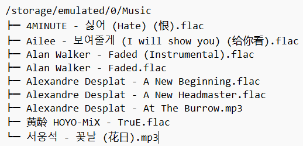
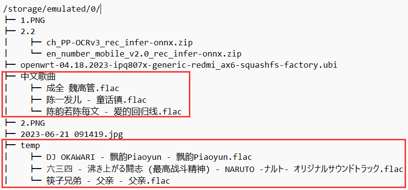

<h3>中文 / <a href="README_ENG.md">English</a></h3>

    
    <h2>欢迎使用 歌单无界</h2>

[//]: # (    <h3 align="center">本工具独立使用即可，也可配合 <a href="https://github.com/Winnie0408/SaltPlayerConverter">椒盐歌单转换助手</a> 用于生成本地歌曲信息，并在电脑、平板等大屏设备上使用。</h3>)

## 🌈 项目介绍

> **⚠️注意⚠️**
>
> 本项目只提供**歌单**的迁移与转换功能，**不具有**音乐下载、传输、播放的能力，您需要自行使用其他方式来获取非加密格式(flac、mp3、wav等)的音乐文件。

现在，已经有大量用户将主力使用的音乐软件从**在线音乐平台**转为了**本地音乐播放器**，虽然歌曲可以很顺利且快速地进行迁移操作，但是无法将自己创建的歌单、或者其他用户的优秀歌单一并进行快速迁移操作，这个项目就是为了解决这个问题而诞生的。

本项目能够将用户保存在网易云音乐、QQ音乐、酷狗音乐、酷我音乐这4个在线音乐平台的歌单数据，转换成支持的本地音乐播放器 **（目前支持：Salt Player、APlayer、Poweramp）** 可识别的歌单格式，完成歌单的导入操作，方便用户快速从在线音乐平台迁移歌单到本地音乐播放器。

## 🤖 支持的Android版本

- 推荐：Android API Level 31（Android S, 12.0）及以上版本。
- 兼容：Android API Level 26（Android O, 8.0）及以上版本。

## 💎 项目特点

1. 使用Jetpack Compose进行UI设计，界面简洁美观。
2. 使用[Salt UI](https://github.com/Moriafly/SaltUI)为UI基础组件。
3. 完全在本地进行歌单数据的转换，不会上传任何数据到服务器。
4. 支持多种在线音乐平台的歌单数据，以及多种本地音乐播放器的歌单格式，可根据需要自行选择。
5. 保留原歌单的排序方式，不会因为转换而改变原歌单的排序。
6. 保留对[椒盐歌单转换助手](https://github.com/Winnie0408/SaltPlayerConverter)的支持，生成的结果文件仍可在电脑、平板等大屏设备上使用。
7. 多语言支持，目前支持简体中文、英语、韩语。
8. 干净无广告，且只在必要时（获取在线歌单数据、检查版本更新等操作）连接互联网。
9. 提供自定义选项，支持部分Material 3特性。
10. 💫 在App中登录音乐平台的账号，即可**直接从对应平台在线获取歌单数据，无需再手动寻找数据库文件**。
11. 💫 设备**已有Root权限**的用户，可使用Root权限自动获取歌单来源App的数据库文件。
12. 更多特性，等待您的发现！

## 🎞️ 视频教程

🛠️ 施工中……

## 📱 需要使用的软件

本项目需要配合以下软件一起使用：

- [受支持的在线音乐平台](README.md#-音乐平台的选择)的Android客户端（选择自己使用的一个或多个平台）
    - [网易云音乐](https://music.163.com/)**（推荐）**
    - [QQ音乐](https://y.qq.com/)**（推荐）**
    - [酷狗音乐](https://www.kugou.com/)
    - [酷我音乐](https://www.kuwo.cn/)
- 音乐标签
    - [Windows](https://www.cnblogs.com/vinlxc/p/11347744.html)
    - [Android](https://www.coolapk.com/apk/com.xjcheng.musictageditor)**（推荐）**
- 文件管理器（选择一个即可）
    - [MT管理器](https://www.coolapk.com/apk/bin.mt.plus)**（推荐）**
    - [ES文件浏览器](https://www.coolapk.com/apk/com.estrongs.android.pop)
    - [MiXplorer](https://mixplorer.com)
- Android虚拟机（当前设备**未获取**Root权限时需要，选择一个即可）
    - [VMOS Pro](https://www.coolapk.com/apk/com.vmos.pro)：在手机上使用的虚拟机 ~~（可能需要使用VIP版，详情查看该应用的酷安评论区）~~
    - [MuMu模拟器](https://mumu.163.com)：在电脑上使用的虚拟机
- Salt Player（或糖醋音乐） 或/与 APlayer 或/与 Poweramp

## ✨ 使用说明

### 0. 📲 安装应用程序

- 若当前设备有Root权限，直接在本项目的Release中下载最新版本的**app-release.apk**文件，安装即可。
- 若当前设备没有Root权限，在本项目的Release中下载最新版本的**app-release.apk**文件后：
    - 安装在当前设备中：
        - （**推荐**）使用软件提供的在线获取歌单数据功能。
        - 使用虚拟机提供的Root权限来获取歌单来源App的数据库文件，并导出到真机中。
    - 安装在虚拟机中，使用虚拟机提供的Root权限来自动获取歌单来源App的数据库文件。
        - 可选的虚拟机 **（虚拟机的系统需要Android API Level 26（Android O, 8.0）及以上）**：
        - [VMOS Pro](https://www.coolapk.com/apk/com.vmos.pro)：在手机上使用的虚拟机 ~~（可能需要使用VIP版，详情查看该应用的酷安评论区）~~
        - [MuMu模拟器](https://mumu.163.com)：在电脑上使用的虚拟机
        - 或其他支持启用Root权限的虚拟机

### 1. 🛠️ 对应用进行自定义设置

1. 打开**歌单无界**应用程序。
2. 点击底部导航栏的**设置**按钮。
3. 根据您的喜好与设备情况，进行相关设置：
    - 动态取色：启用后，应用的主题颜色会根据您的壁纸进行动态取色 **（仅支持Android 12+）**。
    - 主题模式：选择应用的主题模式（跟随系统、浅色、深色）。
    - 使用Root权限：启用后，应用会使用Root权限自动获取歌单来源App的数据库文件 **（仅支持设备已有Root权限的用户）**。
    - 选择加密服务器：在线获取某些平台的歌单数据时，需要先请求加密服务器将请求字符串加密，再向平台请求数据。提供3个加密服务器供选择，以备不时之需。
    - 语言：选择应用的语言（简体中文、English、한국어）。
    - 触感反馈：启用后，应用会在某些操作时进行震动反馈。
    - 启动时检查更新：启用后，应用会在启动时检查是否有新版本。

### 2. 🔄️ 刷新本地音乐的标签（ID3 Tag）信息

> **☢️警告☢️**
>
> 本步骤会**覆盖**您本地音乐的ID3标签信息，**请谨慎操作**！
>
> 若您之前已经自行匹配（或修改）过歌曲的ID3信息，可跳过本步骤。
>
> 若后续匹配结果不理想，再进行此步骤，并重新进行扫描即可。

1. 将音乐文件保存在手机里（相信您已经完成这个步骤了）。
2. 打开**音乐标签**APP。
    1. 点击右上角**刷新**按钮，令其扫描手机中的音乐文件。
    2. 点击左上角**菜单**按钮，点击弹出菜单底部的**设置**。
    3. 点击**组合标签源**，**仅启用**与歌单来源平台**对应的**数据源，点击确定（比如，歌单来源平台为**网易云音乐**，则只启用**网易云**标签源，其他标签源都应**禁用**，若歌单来源平台为**酷狗音乐**，则启用**QQ与酷我**标签源，且QQ的优先级**高于**酷我）。
    4. 返回到音乐标签主界面，点击右下角的**编辑**按钮，点击**自动匹配标签**。
    5. 在弹出的对话框中，**仅勾选**标题、艺术家、专辑，**并同时启用**其右侧的覆盖选项，按需调整“网络搜索线程数”，点击确定。
    6. 等待音乐标签批量匹配完成。

### 3. 🔎 扫描设备中的所有歌曲文件

1. 打开**歌单无界**应用程序。
2. 点击底部导航栏的**扫描**按钮（应用打开默认处于本页面）[支持的音乐格式](README.md#-支持的音乐格式)。
3. 若您需要将扫描结果导出，请启用**导出结果**开关（仅当您需要在其他设备上进行歌单转换操作时，才需要打开本开关），并选择文件格式：
    - 在另一台Android设备上使用：选择**数据库.db文件**。
    - 在电脑、平板等大屏设备上使用：选择**文本.txt文件**
4. 点击**开始**按钮，并授予[请求的权限](README.md#-需要使用的权限)（如果未授予的话）。
5. 选择您设备中存放音乐文件的目录，方法如下表格所示： 
   

   
展开表格

   **注意图片中第一行显示的当前父目录**

   | 音乐文件存放类型 | 在同一个目录中                                |
      |----------|----------------------------------------|
   | 目录树示例    |  | 
   | 操作方法     | 直接选择到父目录`Music`即可                      | 

   | 音乐文件存放类型 | 在同一目录的子目录中                             |
      |----------|----------------------------------------|
   | 目录树示例    |  |
   | 操作方法     | 直接选择到父目录`Music`即可                      |

   | 音乐文件存放类型 | 在不同目录中                                                               |
      |----------|----------------------------------------------------------------------|
   | 目录树示例    |                                |
   | 操作方法     | 需要进行多次选择操作，每次选择**一个**存放音乐的目录(如图中的`中文歌曲`、`temp`)，并在接下来的冲突对话框中选择**追加** |

   

6. 等待应用扫描完成（完成后会有Toast与震动提示）。

### 4. 🚀 进行歌单的转换

> **ℹ️提示ℹ️**
>
> 若您使用**在线获取歌单数据**功能，请跳转查看[第4.3节 开始歌单转换的操作](README.md#43--开始歌单转换的操作)。

#### 4.1. 📓 获取在线音乐平台的歌单数据

1. 打开需要使用的在线音乐平台客户端APP。
2. 登录账号。
3. **依次**点击进入自己的所有歌单（或者需要导出的歌单），并滑动到歌单页的**最底部**，加载当前歌单的所有歌曲。
4. 重复上述步骤，直到所有要导出的歌单**都加载过一次**。
5. 主动关闭在线音乐平台客户端（在软件菜单中选择**关闭**\[推荐\]，或在多任务界面中将其划掉）。

#### 4.2. 🛰️ 获取歌单来源App的数据库文件

（若设备**已有**Root权限，且在**设置**中启用了**使用Root权限**开关的用户，可跳过本步骤）

（若设备没有Root权限，需在虚拟机中进行本步骤）

1. 打开文件管理器，**授予Root权限**，进入在线音乐平台客户端的**数据目录**，找到**databases**文件夹，找到指定的数据库文件。 
   *若觉得各个软件的数据目录比较难找，可以使用MT管理器快速定位：`点击左上角菜单-点击安装包提取-选择需要的音乐APP-点击数据目录1`，即可快速跳转到数据目录。*
    

    
展开数据路径

    - 网易云音乐
        - 数据目录：`/data/user/0/com.netease.cloudmusic/databases`
        - 数据库文件：`cloudmusic.db`
    - QQ音乐
        - 数据目录： `/data/user/0/com.tencent.qqmusic/databases`
        - 数据库文件：`QQMusic`
    - 酷狗音乐
        - 数据目录：`/data/user/0/com.kugou.android/databases`
        - 数据库文件：`kugou_music_phone_v7.db`
    - 酷我音乐
        - 数据目录：`/data/user/0/cn.kuwo.player/databases`
        - 数据库文件：`kwplayer.db`

   

2. 将数据库文件复制到外部存储空间的任意目录中（如Download、Document等）。

#### 4.3. 🎌 开始歌单转换的操作

1. 打开**歌单无界**应用程序。
2. 点击底部导航栏的**转换**按钮。
3. 选择**歌单来源平台**：
    - 选择歌单来源App的数据库文件 **（在线获取歌单、Root用户忽略）**
4. 选择**歌单获取方式**：
    - 在线获取：在点击下一步按钮后，弹出的对话框中选择登录方式：
        - 网页登录：软件将打开所选择的在线音乐平台的登录网页，您需要登录账号（扫码、输入账号密码皆可），登录成功后，点击**确定**按钮。
        - Cookie登录：使用上次网页登录时保留的Cookie信息（若存在且未过期，软件会自动填写），或来自其他浏览器的Cookie信息登录，在输入框内输入Cookie信息，点击**确定**按钮。
        

         
展开各平台需要的Cookie信息

      提供的Cookie**包含必需信息即可**，填写格式为：`key1=value1; key2=value2; key3=value3`，**不需要**填写`path`、`domain`等信息。

      如：`MUSIC_U=XXYYZZ998877; __csrf=aabbcc112233; uid=13811012138`

        - 网易云音乐：`MUSIC_U`、`__csrf`、`uid`（uid需要您[自行获取](README.md#-获取网易云音乐uid)）
        - QQ音乐：`uin`或`wxuin`、`qm_keyst`
        - 酷狗音乐：仅支持扫描二维码登录。（使用车机版的登录接口，需要使用酷狗APP扫码；或者酷狗账号绑定微信后，微信扫码关注“酷狗智能设备”公众号。）
        - 酷我音乐：`Hm_Iuvt`

       

    - 数据库获取：选择歌单来源App的数据库文件。
5. 选择使用本软件的扫描结果，还是来自其他设备的扫描结果。
6. 选择转换后要导入的音乐播放器。
7. 点击**下一步**按钮，并授予[请求的权限](README.md#-需要使用的权限)（如果未授予的话）。
8. 查看检测到的有效歌单，检查**歌单名称、包含的歌曲数量**是否正常，并勾选要转换的歌单，点击**下一步**按钮。
9. 根据需要自定义[转换选项](README.md#-转换选项说明)。
10. 点击**预览转换结果**按钮，等待转换完成（完成后会有震动提示）。
11. 查看转换结果，可以使用**筛选**功能对结果进行相关筛选。
    - 若对当前结果满意，可以直接点击**保存转换结果**按钮，选择要保存的转换状态，继续下一个歌单的转换操作（如果有的话）。
    - 若对当前结果有点不满意，可以点击**转换错误的歌曲**，在您的本地曲库中搜索并修改转换的结果（点击对话框中的“歌名”、“歌手”、“专辑”项，可以快速输入该项内容到输入框中），或者从结果中删除某首歌曲。
    - 若对当前结果非常不满意，可以点击**重新修改参数**按钮，或者直接**返回**，回到上一页，对转换选项进行相关修改后，再次尝试转换。
12. 待之前选择的所有歌单均转换完成后，会跳转到“转换完成”页，可以点击**复制目录路径**按钮，便于直接使用文件管理器，前往查看结果文件；或者点击 **打开\[播放器名称\]** 按钮，直接打开对应的音乐播放器，进行歌单的导入操作。
13. （仅歌单获取方式为**在线获取**才可使用，可选）点击“转换完成”页中的退出登录按钮，退出音乐平台的登录状态。（会导致在第4步时**无法自动填写**Cookie信息）

### 5. 💝 导入歌单到本地音乐播放器

- 🌟 Salt Player（或糖醋音乐）
    

    
展开步骤

    1. 打开Salt Player（或糖醋音乐）。
    2. 点击左上角的**菜单**按钮，或向右滑动。
    3. 点击**歌单**项。
    4. 点击右上角的**菜单**按钮。
    5. 点击 **导入歌单(.txt)** 按钮。
    6. 选择生成的转换结果文件。

  

- 🌟 APlayer
    

    
展开步骤

    1. 打开APlayer。
    2. 点击左上角的**菜单**按钮。
    3. 点击**设置**项。
    4. 点击**歌单导入**项。
    5. 选择 **从外部存储导入(.m3u)** 。
    6. 选择生成的转换结果文件。

    

- 🌟 Poweramp
    

    
展开步骤

    1. 使用文件管理器(系统自带或第三方皆可)，前往生成的转换结果文件所在的目录。
    2. 将所有.m3u8文件复制/移动到Poweramp的媒体库目录中。
    3. 打开Poweramp。
    4. 点击左下角的**媒体库**按钮。
    5. 点击**播放列表**项。
    6. 点击右上角的**菜单**按钮。
    7. 点击**重新扫描/解析播放列表**项。

    

### 6. ℹ️ 查看应用的关于信息

1. 打开**歌单无界**应用程序。
2. 点击底部导航栏的**设置**按钮。
3. 滑动到页面底部，点击**关于**按钮。
4. 查看应用的相关信息：
    - 应用图标
    - 应用名称
    - 应用版本
    - 制作人员（包含❤️感谢名单❤️）
    - 检查更新（手动）
    - 开源代码许可证
    - 打开Salt Convertor 电脑版
    - 赞赏
5. 联系开发者
    - 加入QQ群
    - 关注酷安
    - 关注BiliBili
    - 查看本项目的GitHub仓库
    - 查看本项目的GitLab仓库
    - 查看本项目的Gitee仓库

## 🎵 支持的音乐格式

- OGG
- MP3
- FLAC
- MP4
- M4A
- M4P
- WMA
- WAV
- RA
- RM
- M4B
- AIF
- AIFF
- AIFC
- DSF
- DFF

## ⚙️ 转换选项说明

### 相似度阈值

程序认为两个字符串**相同**的相似度大小，详情：

若当前阈值为0.8：

- **相同**

  字符串1：想いの眠るゆりかご (回忆长眠的摇篮) 
  字符串2：想いの眠るゆりかご (回忆长眠的摇篮) 
  相似度：1.0

- **相同**

  字符串1：伤感 II 
  字符串2：伤感 I 
  相似度：0.8

- **不相同**

  字符串1：I'M OK 
  字符串2：I AM OK 
  相似度：0.7142857142857143

- **不相同**

  字符串1：BANG BANG BANG (뱅뱅뱅) 
  字符串2：BANG BANG BANG 
  相似度：0.7

- **不相同**

  字符串1：이 사랑 (这份爱) (Inst.) 
  字符串2：이 사랑 (这份爱) 
  相似度：0.5555555555555556

- **不相同**

  字符串1：aaabbbccc 
  字符串2：abcabcabc 
  相似度：0.33333333333333337

### 括号去除

大部分音乐平台对外语歌曲信息的命名方式一般为： `外文 (中文翻译)`或`外文 (歌曲来源、歌曲版本等)`。

如`City Of Stars (From "La La Land" Soundtrack)`、`CALL ME BABY (叫我) (Chinese Ver.)`、`桜色舞うころ (樱花纷飞时)`。

启用此功能可以将字符串中的括号部分删去，只保留外文名，即：`外文`。如：`City Of Stars`、`CALL ME BABY`、`桜色舞うころ`，以此提高自动匹配成功率。

但需要注意，部分歌曲会在歌名后用括号注明歌曲版本：`歌名 (歌曲版本)`。如`曾经我也想过一了百了 (Live)`、`TruE (Ed Ver.)`，在这种情况下，若启用了本功能，会将其变成：`曾经我也想过一了百了`、`TruE`，继而**可能会出现匹配错误**。

请您根据您的实际情况，决定是否使用本功能。

### 匹配模式

例如：

歌单中歌曲的信息如下：

歌名：小幸运

歌手：田馥甄

专辑：我的少女时代 电影原声带

---

本地歌曲的信息如下：

歌名：小幸运

歌手：田馥甄

专辑：我的少女时代 电影原声大碟

### 总体匹配

将歌曲的\[歌名\] \[歌手\] \[专辑\]拼接成一个字符串，进行匹配，找到相似度最大的歌曲。表格中将显示整体匹配的相似度。

本匹配方法将使用：

`小幸运田馥甄我的少女时代 电影原声带`

与

`小幸运田馥甄我的少女时代 电影原声大碟`

进行匹配，相似度结果为：89.47%。

### 分离匹配

将歌曲的\[歌名\] \[歌手\] \[专辑\]分别进行匹配， 找到相似度最大的歌曲。 表格中将显示每个匹配项的相似度。

本匹配方法将分别使用：

- `小幸运`与`小幸运`
- `田馥甄`与`田馥甄`
- `我的少女时代 电影原声带`与`我的少女时代 电影原声大碟`

进行匹配，相似度结果分别为：

- 100%
- 100%
- 84.62%

## 🎪 音乐平台的选择

### **网易云音乐** 与/或 **QQ音乐**

这两个平台的歌曲信息正确率较高，且较为完整、权威，可以有效提高自动匹配的成功率。

### 酷狗音乐

该平台歌曲信息不太符合规范，合唱歌曲的艺术家名使用`、`分隔，且括号、斜杠的使用比较混乱，且**非【我喜欢】歌单**中歌曲的专辑信息不会保存到数据库中，导致匹配精确度下降，不太建议使用。

### 酷我音乐

该平台歌曲信息不太符合规范，合唱歌曲的艺术家名使用`&`分隔，且括号、斜杠的使用比较混乱，且有很多用户自行上传的歌曲，这些歌曲的ID3信息大部分都不完整且不合规范，可能导致匹配精确度下降，不太建议使用。

## 🍬 获取网易云音乐UID

- 移动端App：
    1. 打开网易云音乐APP，并登录。
    2. 点击屏幕下方中间的**我的**按钮。
    3. 点击您的头像或昵称。
    4. 点击右上角...，选择**编辑资料**，或直接点击**编辑资料**按钮。
    5. 点击最后一项**账号和绑定设置**
    6. 您的UID会显示在页面的最上方。

- 电脑端（或移动端浏览器使用电脑UA）网页版：
    1. 打开[网易云音乐](https://music.163.com/)，并登录。
    2. 点击页面右上角的头像，点击弹出菜单中的**我的主页**项。
    3. 查看浏览器地址栏中的`/home?id=xxxxx`，xxxxx即为您的UID。

## 👀 需要使用的权限

- **访问互联网** (`android.permission.INTERNET`)：用于请求音乐平台服务器，在线获取歌单数据、检查更新、获取应用的更新日志、获取应用的更新信息。
- **控制设备的震动马达** (`android.permission.VIBRATE`)：用于在某些操作时进行震动反馈。
- **读取音乐App的包名、应用名称等信息** (`<queries>...</queries>`)：用于在选择歌单来源时，显示歌单来源App的图标、名称等信息。
- Android 11 (API 30) 及以上：
    - **所有文件管理权限** (`android.permission.MANAGE_EXTERNAL_STORAGE`)：从外置存储(`/storage/emulated/0`)及其子目录中读取音乐文件，写入结果文件
- Android 10 (API 29) 及以下：
    - **读外置存储权限** (`android.permission.READ_EXTERNAL_STORAGE`)：从外置存储(`/storage/emulated/0`)及其子目录中读取音乐文件
    - **写外置存储权限** (`android.permission.WRITE_EXTERNAL_STORAGE`)：向下载目录(`/storage/emulated/0/Download`)中写入结果文件

## 🧐 访问数

（统计开始于2024.2.9）

## 🌟 星标历史

## 🥰 赞助与支持

如果这个项目对您有所帮助，您可以给我一颗免费的⭐，或者请我喝杯咖啡！ 
非常感谢您的支持！  
⬇️⬇️⬇️ 
